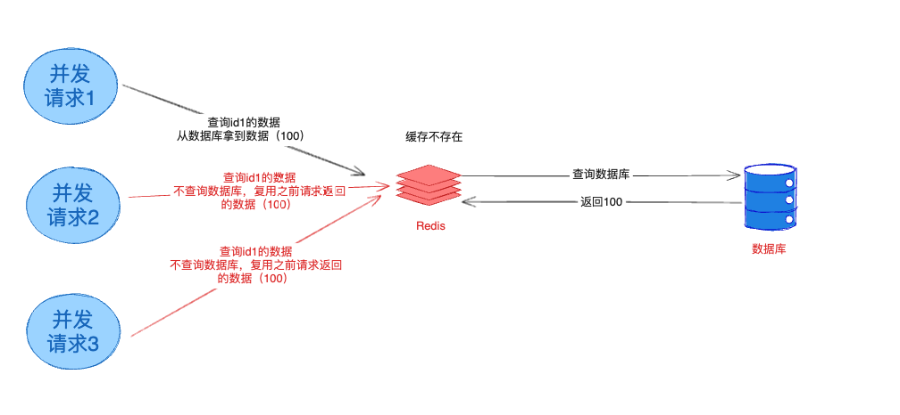

# singleflight
singleflight Java 实现，接入方可2行代码即可实现防缓存击穿。

# 作用：
在缓存查询场景，如果缓存不存在，可能需要查询数据库/下游接口去获取数据，如果并发请求很多，这时候这些请求均不命中缓存就会透传至数据库/下游，从而瞬间压力就会上升。这种现象叫缓存穿透，如下图所示：


其实这些数据都是几乎一瞬间请求的，数据不会发生变更，如果能复用一条请求的数据，则可以把N个并发下降至1。如下图所示：
JSingleflight则可以轻松实现这样的线程模型。如下图所示，并发请求的三个线程，红色颜色的并发请求并没有请求到数据库，而是直接复用了黑色线段的请求结果。从而把原本对数据库的3个请求压力降为1个。




# 原理
在发现相同的key请求时，JSingleflight只会放行其中一条请求，其余请求均会等待这条请求的结果，即等到该请求结果返回之后，会立刻唤醒等待的线程去读取这个结果从而返回。


# 快速开始

使用SingleFlight非常简单，只需要一行代码——把原本需要保护复用的代码片段做成回调传入`goFlight`方法即可。

以下是一个多线程的例子，线程内都需要为某个id对应的数据库的值。以下示意我们用随机数来示意数据库查询的语句。

有一瞬间有10个线程都是获取`id_1`这个数据，那么最后只会生成一个随机数（证明只查询了一次数据库），其他线程都会复用一样的结果：

        SingleFlight<String> sg = new SingleFlight<>();
        //并发请求10次，只有一个请求真正进回调，其他9个请求均复用第一次的结果，所以N出来的结果都是一样的
        for (int i=0;i<10;i++) {
            new Thread(new Runnable() {
                @Override
                public void run() {
                    try {
                        String result = sg.goFlight("id_1", key -> {
                            System.out.println("querying from database...");
                            Thread.sleep(100);//假装需要100毫秒处理数据库
                            return "data_1_" + new Random().nextInt(100000);
                        });
                        System.out.println("singleflight result = " + result);
                    } catch (Exception e) {
                        e.printStackTrace();
                    }
                }
            }).start();
        }


# 特性
SingleFlight除了基本特性外，对比`Go`版本的`singleflight`，还增加了对异常、超时的处理

## 超时策略

如果下游的一次请求耗时太长，其他所有线程都会阻塞。为了解决这个问题，JSingleFlight引入了超时策略的概念。

超时策略里，可以设置超时时间（默认超时时间无限长）。如果一个操作超过了这个超时时间，就会触发超时策略。具体超时策略有两种：
  1. 超时抛出异常策略。默认策略。本次请求超时会抛出异常，其他等待的请求也会跟随的获取到这个超时异常。使用方法只需要增加一行代码即可：


     SingleFlight<String> sg = new SingleFlight<>();
     // 500毫秒超时，超时则抛出异常 
     sg.setTimeoutStrategy(TimeoutStrategy.throwException(500));

   2. 超时放过策略。有些时候为了避免一次请求的超时而扩散影响到并发的其他请求，可以尝试超时后放N等待的请求进去再尝试一下。这时候可以使用超时放过策略。其中N可以参数控制。使用方法也很简单，只需要在原基础上增加一行代码即可：
      
 ```
      SingleFlight<String> sg = new SingleFlight<>();
      // 500毫秒超时，超时的时候最多可以放进去5个请求继续尝试处理
      sg.setTimeoutStrategy(TimeoutStrategy.permitSome(500, 5));
```

## 异常策略
类似于超市测量的处理，`goFlight`的回调方法可能会抛出异常（例如连接数据库失败等），在异常时默认会透传出这个异常，同时把等待中的请求也会得到相同的异常。如果希望异常的时候放进去N个请求再做尝试，可以在构造方法中设置参数：

    //goFlignt抛出异常的时候，最多尝试放5个新请求进去继续执行
    SingleFlight<String> sg = new SingleFlight<>(5);
